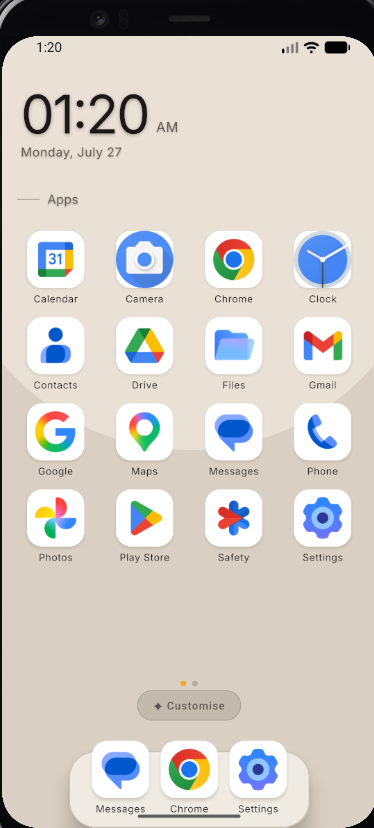
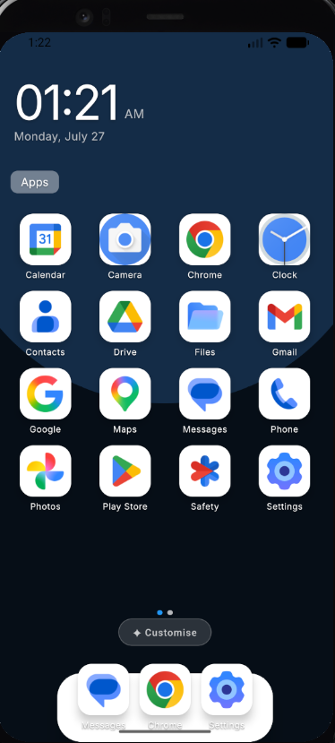
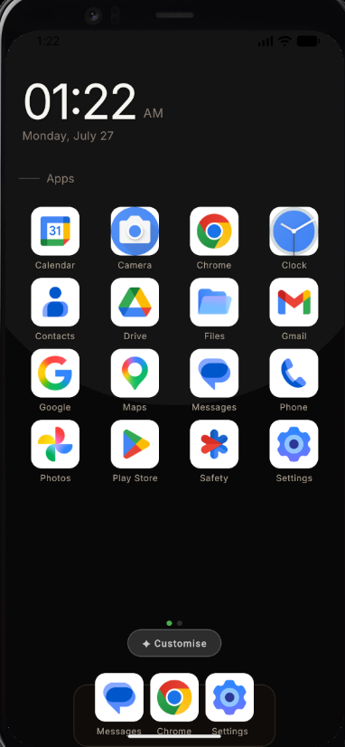
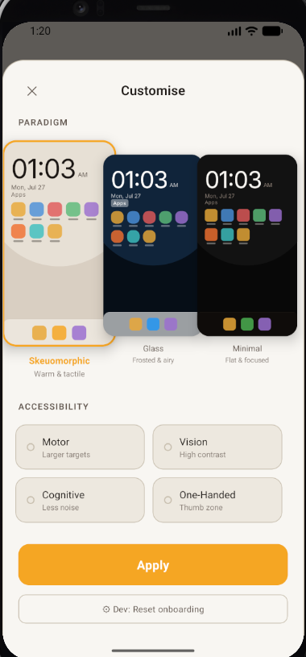

# Weft

<p align="center">
  
  
  
  
</p>

<p align="center">
  <strong>A modular, accessibility-centered Android launcher built with React Native.</strong><br />
  Three visual paradigms. Four accessibility profiles. One compose pipeline.
</p>

<p align="center">
  
  
  
  
</p>

---

## What is Weft?

Weft is a fully functional Android home screen launcher that demonstrates a live design token architecture. Every visual property — colors, typography, shadows, spacing, radii — flows through a single composable pipeline:

```
compose(paradigm, activeProfiles) → AppSemantics
```

Switch paradigm from **Skeuomorphic** to **Glass** to **Minimal**, toggle **Motor**, **Vision**, **Cognitive**, or **One-Handed** accessibility profiles, and the entire UI recomposes in real time. No conditional logic inside components. No duplicated styles. One pure function determines the visual output of the whole app.

---

## Screenshots

| Skeuomorphic | Glass | Minimal | Customise |
|:---:|:---:|:---:|:---:|
|  |  |  |  |
| Warm parchment, amber accent | Frosted dark, cool blue | Flat near-black, sage green | Live paradigm picker |

---

## Features

### Three Visual Paradigms

| | Skeuomorphic | Glass | Minimal |
|---|---|---|---|
| **Background** | Warm parchment tones | Frosted dark surfaces | Near-black flat |
| **Accent** | Amber | Cool blue | Sage green |
| **Depth** | Soft shadows & elevation | Translucent tints + blur | Zero elevation |
| **Radii** | 16px | 22px | 12px |
| **Typography** | Inter UI + Fraunces display | Inter UI + Fraunces display | Inter UI |

### Four Accessibility Profiles

Each profile is an independent delta applied on top of the active paradigm. Multiple profiles compose simultaneously in a fixed order.

| Profile | Changes |
|---|---|
| **Motor** | Touch targets → 72px, wider grid gaps, taller dock |
| **Vision** | Larger typography, maximum contrast, raised plate opacity |
| **Cognitive** | 4→3 column grid, reduced chrome, simplified layout |
| **One-Handed** | Grid shifts into thumb zone (right-biased padding) |

### Glass × Vision Cascade

When both Glass paradigm and Vision profile are active, a special intersection rule fires automatically in `compose.ts`:

- Container tint deepens from 60% → 92% opacity
- Section header plates clear to transparent
- Tile status chips become transparent
- WCAG-grade contrast guaranteed without a separate design decision

### Launcher Capabilities

- **Live clock widget** — updates every second, entrance animation on load
- **Real app grid** — reads installed apps from the device, paginated horizontal swipe
- **Page indicator dots** — accent-colored active dot, 30% inactive
- **Dock** — pinned apps with haptic long-press feedback
- **Floating Customise pill** — sits above the dock, non-intrusive
- **Pull-down Control Center** — 6 toggle tiles + brightness/volume sliders
- **Customization screen** — live `PreviewCard` per paradigm, local pending state
- **Onboarding flow** — first-launch paradigm picker with animated card selection
- **Spring press animations** — 0.88 scale squish on every icon, native driver
- **Haptic feedback** — 50ms vibration on icon long-press
- **System wallpaper passthrough** — reads real wallpaper via `WallpaperManager`, renders behind UI
- **Edge-to-edge display** — draws behind status bar and navigation bar
- **Persistent config** — `AsyncStorage` survives app restarts and phone reboots
- **System UI theming** — nav bar and status bar icon tints match active paradigm
- **Default launcher prompt** — `RoleManager` dialog after onboarding

---

## Architecture

### The Core Insight

```
compose(paradigm, activeProfiles) → AppSemantics
```

Every component reads exclusively from `AppSemantics` via `useWeftConfig().semantics`. No component checks which paradigm is active or which profiles are on. The entire visual system is determined by a single pure function.

### Three-Tier Token System

```
Tier 1 — Primitives  (src/tokens/primitives.ts)
  Raw values: color ramps, spacing scale, radii, shadows, typography scale
  Nothing reads primitives directly except tier 3.

Tier 2 — Semantics  (src/tokens/semantics.ts)
  Typed AppSemantics interface — the contract every component reads from.
  Fields: surface.home, surface.controlCenter, component.tile,
          component.dock, component.appIcon, layout, accent, state.tile

Tier 3 — Paradigm Factories  (src/tokens/paradigms.ts)
  semanticsSkeuo() | semanticsGlass() | semanticsMinimal()
  Each returns a complete AppSemantics object populated from primitives only.

Profile Deltas  (src/tokens/profiles.ts)
  applyMotor() | applyVision() | applyCognitive() | applyOneHanded()
  Accept AppSemantics, override relevant fields, return new AppSemantics.
  Paradigm-agnostic — no branching on paradigm identity.

Compose Pipeline  (src/compose/compose.ts)
  1. Select paradigm factory → base AppSemantics
  2. Apply profile deltas: Motor → Vision → Cognitive → OneHanded
  3. Apply intersection cascades (Glass × Vision rule)
  4. Object.freeze() → return
```

### Adding Things

| Task | Work required |
|---|---|
| New paradigm | One factory function in `paradigms.ts` |
| New accessibility profile | One delta function in `profiles.ts` |
| New component | Read existing tokens from `useWeftConfig().semantics` |
| New intersection rule | One block in `compose.ts` |

### Project Structure

```
src/
├── tokens/
│   ├── primitives.ts           Raw values — color ramps, spacing, typography, shadows
│   ├── semantics.ts            Typed AppSemantics interface
│   ├── paradigms.ts            Three paradigm factories
│   └── profiles.ts             Four accessibility profile deltas
├── compose/
│   └── compose.ts              Pipeline: paradigm + profiles → AppSemantics
├── context/
│   ├── WeftConfigContext.tsx   Live config state + AsyncStorage persistence
│   └── types.ts                Paradigm, AccessibilityProfile, WeftConfig types
├── surfaces/
│   ├── HomeScreen.tsx          App grid, clock widget, dock, pagination
│   ├── ControlCenterScreen.tsx Pull-down control panel overlay
│   ├── CustomizationScreen.tsx Paradigm picker + profile toggles + PreviewCard
│   └── OnboardingScreen.tsx    First-launch paradigm selection
├── components/
│   ├── AppIcon.tsx             Spring press animation, shadow + clip split
│   ├── ClockWidget.tsx         Live time/date with entrance animation
│   ├── Dock.tsx                Bottom dock pill with elevation shadow
│   ├── PreviewCard.tsx         Miniature live HomeScreen preview
│   ├── SectionHeader.tsx       Label with optional backing plate + divider line
│   ├── Tile.tsx                Control Center toggle tile
│   ├── Toggle.tsx              Binary on/off control
│   ├── Slider.tsx              Range input (brightness, volume)
│   ├── WidgetCard.tsx          Widget container card
│   └── WallpaperBackground.tsx System wallpaper + paradigm tint crossfade
├── hooks/
│   ├── useWeftConfig.ts        Typed context hook
│   └── useInstalledApps.ts     Device app list + install/remove listener
android/app/src/main/java/com/weft/
├── WallpaperModule.kt          Reads system wallpaper as base64 JPEG
├── WeftSystemUIModule.kt       Sets nav bar + status bar icon tints
└── SetDefaultLauncherModule.kt RoleManager dialog for default home app
```

---

## Prerequisites

| Requirement | Version |
|---|---|
| Node.js | ≥ 20.19.4 |
| Java JDK | **17 exactly** — not 21 |
| Android Studio | Latest stable |
| Android SDK Platform | 34 |
| Android Build Tools | 34.0.0 |
| Android NDK | 26.1.10909125 |
| Device / emulator | API 29+ (Android 10+) |

Verify your setup:

```sh
npx react-native doctor
```

---

## Setup & Running

### 1. Clone and install

```sh
git clone https://github.com/your-username/weft.git
cd weft
npm install
```

`@react-native-async-storage/async-storage` and `@react-native-community/blur` are native modules — they require a full native build. `npm start` alone is not sufficient after a fresh install.

### 2. Build and run

```sh
npm run android
```

First build: 3–5 minutes. Subsequent builds are incremental.

### 3. Set Weft as default launcher

After the app installs, press **Home**. Android will show a **"Choose default launcher"** dialog — select **Weft → Always**.

If the dialog doesn't appear automatically: **Settings → Apps → Default apps → Home app → Weft**

To restore your previous launcher: same path, select the other launcher.

---

## Building a Release APK

### 1. Generate a signing keystore (once)

```sh
cd android
keytool -genkeypair -v -storetype PKCS12 \
  -keystore weft-release.keystore \
  -alias weft \
  -keyalg RSA -keysize 2048 -validity 10000
```

### 2. Add signing credentials to `android/gradle.properties`

```properties
MYAPP_RELEASE_STORE_FILE=weft-release.keystore
MYAPP_RELEASE_KEY_ALIAS=weft
MYAPP_RELEASE_STORE_PASSWORD=your_store_password
MYAPP_RELEASE_KEY_PASSWORD=your_key_password
```

### 3. Configure signing in `android/app/build.gradle`

```groovy
signingConfigs {
    release {
        storeFile file(MYAPP_RELEASE_STORE_FILE)
        storePassword MYAPP_RELEASE_STORE_PASSWORD
        keyAlias MYAPP_RELEASE_KEY_ALIAS
        keyPassword MYAPP_RELEASE_KEY_PASSWORD
    }
}

buildTypes {
    release {
        signingConfig signingConfigs.release
        minifyEnabled enableProguardInReleaseBuilds
        proguardFiles getDefaultProguardFile("proguard-android.txt"), "proguard-rules.pro"
    }
}
```

### 4. Build the APK

```sh
cd android
gradlew.bat assembleRelease
```

Output: `android/app/build/outputs/apk/release/app-release.apk`

### 5. Install to device

```sh
adb install android/app/build/outputs/apk/release/app-release.apk
```

> ⚠️ Never commit `weft-release.keystore` to version control. Add it to `.gitignore`.

For an Android App Bundle (Play Store): `gradlew.bat bundleRelease`

---

## Splash Screen

To add a launch logo:

1. Place your PNG at `android/app/src/main/res/drawable/splash_logo.png`
2. The splash is already wired — it reads `@drawable/splash_logo` from `splash_background.xml`
3. Rebuild with `npm run android`

Adjust the displayed size in `android/app/src/main/res/drawable/splash_background.xml` by changing `android:width` / `android:height` (default: 120dp × 120dp).

---

## Development Notes

### Reset onboarding (dev only)

Open **Customise** → scroll to the bottom → tap **⚙ Dev: Reset onboarding**. This clears `AsyncStorage` and reloads the JS bundle. Only visible in `__DEV__` builds.

### Paradigm switching performance

`setParadigm` and `toggleProfile` are wrapped in `InteractionManager.runAfterInteractions` so paradigm switches never block the touch animation that triggered them.

### Shadow rendering on Android

Android `elevation` requires a non-transparent `backgroundColor` on the view to render the shadow. All shadow-bearing views (app icons, dock) use a white opaque background on the shadow carrier, with the actual visual background rendered in a child view on top. This is documented in `AppIcon.tsx` and `Dock.tsx`.

---

## Troubleshooting

**NDK build error: version 26.1.10909125 required**
Android Studio → SDK Manager → SDK Tools → NDK (Side by side) → install 26.1.10909125.

**Home button goes to old launcher**
Settings → Apps → Default apps → Home app → select Weft. Or open Weft → Customise → the app will prompt you.

**Blur not visible on Glass paradigm**
`@react-native-community/blur` needs a full native rebuild. Run `npm run android`, not just a Metro restart. Blur behaves differently on emulators vs physical devices.

**Icons blank on first launch**
Grant `QUERY_ALL_PACKAGES`. On Android 11+ a system permission dialog may appear — grant it and return.

**Wallpaper shows as gradient, not real photo**
On emulators, no wallpaper is set by default. Go to emulator Settings → Wallpaper and set one. On physical devices this works automatically if `READ_WALLPAPER_INTERNAL` / `READ_EXTERNAL_STORAGE` permissions are granted.

**White flash on launch**
The splash theme (`SplashTheme` in `styles.xml`) should prevent this. If you see a flash, ensure `android:theme="@style/SplashTheme"` is set on the `<activity>` in `AndroidManifest.xml` and `setTheme(R.style.AppTheme)` is called in `MainActivity.onCreate` before `super.onCreate`.

---

## Native Modules

| Module | Purpose |
|---|---|
| `WallpaperModule` | Reads device wallpaper via `WallpaperManager`, returns base64 JPEG data URI |
| `WeftSystemUIModule` | Sets nav bar + status bar icon tints via `WindowInsetsControllerCompat` |
| `SetDefaultLauncherModule` | Triggers `RoleManager.ROLE_HOME` dialog on Android 10+, falls back to Settings on older |

---

## Fonts

Weft bundles three typefaces under `android/app/src/main/assets/fonts/`:

| Font | Usage |
|---|---|
| **Inter** (variable) | UI labels, section headers, body copy, clock |
| **Fraunces** (variable) | Display sizes, hero text, onboarding wordmark |
| **JetBrains Mono** | Monospaced readouts |

---

## Tech Stack

| Technology | Role |
|---|---|
| React Native 0.86 | Core framework, New Architecture enabled |
| TypeScript 5 | Strict typing throughout the token system |
| AsyncStorage | Config persistence across restarts |
| react-native-launcher-kit | Installed app enumeration + launching |
| react-native-safe-area-context | Edge-to-edge insets |
| @react-native-community/blur | Glass paradigm frosted panel |
| Kotlin | Three native modules for system-level features |

---

## Releases

![Download_APK]|(https://github.com/cipher-d-dev/Weft/releases/download/luancher/app-release.apk)

---

## License

MIT
